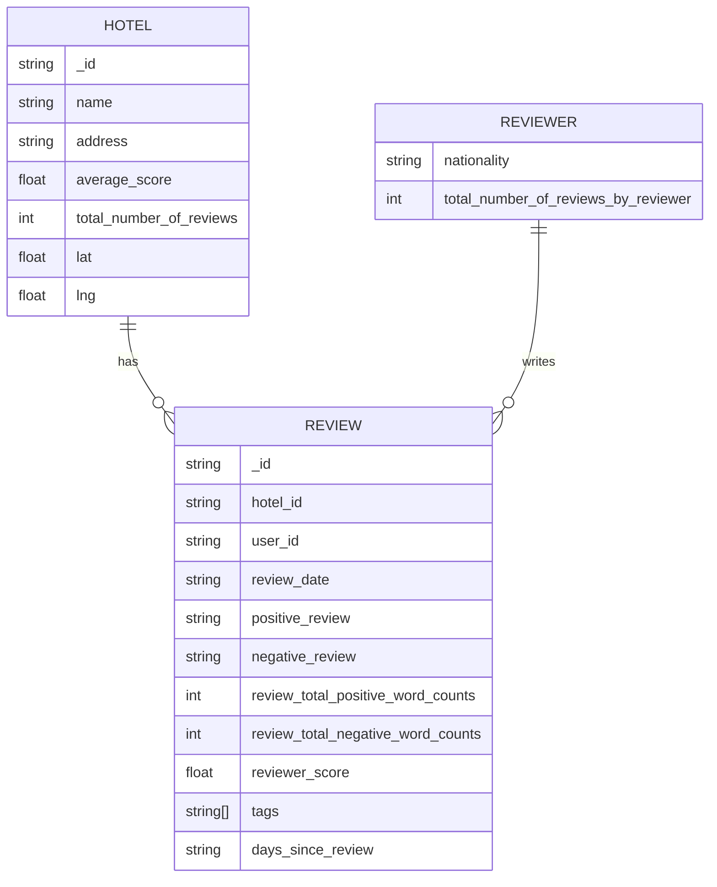

```mermaid
erDiagram
    HOTEL ||--o{ REVIEW : has
    REVIEWER ||--o{ REVIEW : writes

    HOTEL {
        string _id
        string name
        string address
        float average_score
        int total_number_of_reviews
        float lat
        float lng
    }

    REVIEW {
        string _id
        string hotel_id
        string user_id
        string review_date
        string positive_review
        string negative_review
        int review_total_positive_word_counts
        int review_total_negative_word_counts
        float reviewer_score
        string[] tags
        string days_since_review
    }

    REVIEWER {
        string nationality
        int total_number_of_reviews_by_reviewer
    }
```